# Cyber Casino Monorepo

[](https://nodejs.org/)
[](https://docs.docker.com/compose/)
[](https://www.postgresql.org/)
[](https://playwright.dev/)
[](#build-and-verification)
[](#testing-strategy)
[](#license)

Cyber Casino is an experimental real-time gaming platform built as an npm-workspaces monorepo. It combines player-facing games, account and wallet operations, configurable game mechanics, loyalty processing, affiliate features, administrative controls, and real-time events in one engineering workspace.

> [!WARNING]
> This repository is **not certified for real-money gambling or production financial use**. Important hardening is implemented, but the ledger, payment, observability, migration, rate-limiting, compliance, and operational controls listed in [Production readiness](#production-readiness) remain mandatory before launch.

## Contents

- [Executive overview](#executive-overview)
- [Feature matrix](#feature-matrix)
- [Screenshots](#screenshots)
- [Technology stack](#technology-stack)
- [Architecture](#architecture)
- [Repository structure](#repository-structure)
- [Service catalog](#service-catalog)
- [API conventions](#api-conventions)
- [Authentication and authorization](#authentication-and-authorization)
- [Database architecture](#database-architecture)
- [Redis and event architecture](#redis-and-event-architecture)
- [Environment configuration](#environment-configuration)
- [Installation and onboarding](#installation-and-onboarding)
- [Development workflow](#development-workflow)
- [Testing strategy](#testing-strategy)
- [CI/CD reference pipeline](#cicd-reference-pipeline)
- [Security](#security)
- [Observability](#observability)
- [Performance and scalability](#performance-and-scalability)
- [Deployment](#deployment)
- [Troubleshooting](#troubleshooting)
- [FAQ](#faq)
- [Contributing](#contributing)
- [Roadmap](#roadmap)
- [License](#license)

## Executive overview

Cyber Casino provides a unified environment for developing and testing:

- registration, login, account status, wallet history, and transactions;
- lottery, crash, dice, slots, spin-wheel, and Plinko games;
- configurable economics, promotions, and administrative controls;
- scheduled lottery draws, ticket settlement, and RNG audit records;
- affiliates, referrals, loyalty points, tiers, and bonuses;
- player and administrator browser applications;
- real-time updates through Socket.IO and Redis Pub/Sub.

The target users are developers, QA engineers, game-product teams, risk specialists, and platform engineers evaluating casino-style mechanics—not production gamblers.

The architecture separates latency-sensitive public APIs, privileged administration, asynchronous loyalty work, and draw settlement. These service boundaries enable independent ownership and future scaling while npm workspaces keep local development simple. The current runtime image remains unified; service-specific images are planned.

## Feature matrix

**Available** means present in the repository. **Partial** means additional production controls are required. **Planned** describes architectural direction only.

| Capability | Status | Notes |
|---|---|---|
| Authentication | Available | JWT access tokens; private-by-default HTTP guards |
| Password protection | Available | Salted scrypt; legacy plaintext upgraded on login |
| RBAC | Available | Backoffice and admin proxy routes require `ADMIN` |
| Wallet/history | Available | Authenticated balance and transaction endpoints |
| Deposits | Partial | Mock deposit exists but is disabled in production |
| Withdrawals | Partial | Atomic debit; no external payout-provider rail |
| Live games | Available | Lottery, crash, dice, slots, spin wheel, Plinko |
| Provably fair records | Partial | Lottery RNG seed/salt/hash audit records |
| Chat | Available | Socket.IO lobby messages and simulated bot messages |
| Affiliates | Available | Referrals, bounties, ranks, commission calculations |
| Loyalty/rewards | Available | Event-driven points, tiers, and level-up bonuses |
| Leaderboards | Available | Game and tournament views |
| Promotions | Available | Bonus rules and referral/welcome rewards |
| Admin dashboard | Available | Game, risk, audit, user, and affiliate controls |
| Reporting | Partial | Operational views; no analytics warehouse |
| Fraud detection | Partial | Device/location alerts and account controls |
| Notifications | Partial | Ephemeral real-time events; no durable notification service |
| Distributed rate limiting | Planned | Mandatory before production |
| Refresh tokens/MFA | Planned | Mandatory for production administration |

## Screenshots

Add sanitized screenshots under `docs/images/`. Never include real personal data, credentials, tokens, seeds-before-reveal, or wallet addresses.

| View | Placeholder |
|---|---|
| Player dashboard | `docs/images/player-dashboard.png` — screenshot needed |
| Admin dashboard | `docs/images/admin-dashboard.png` — screenshot needed |
| Wallet | `docs/images/wallet.png` — screenshot needed |
| Lottery | `docs/images/lottery.png` — screenshot needed |
| Crash game | `docs/images/crash-game.png` — screenshot needed |
| Spin wheel | `docs/images/spin-wheel.png` — screenshot needed |
| Loyalty dashboard | `docs/images/loyalty.png` — screenshot needed |
| Architecture | `docs/images/architecture.png` — optional Mermaid export |

## Technology stack

| Area | Technology | Selection rationale |
|---|---|---|
| Player UI | React 18, Vite, PixiJS | Component model, fast builds, accelerated graphics |
| Admin UI | React 18, Vite | Focused operational UI with a small build surface |
| Backend | Node.js 20, NestJS 11, Express | Dependency injection and structured HTTP/WebSocket services |
| Real-time | Socket.IO | Browser-friendly events, reconnection, broadcasting |
| Database | PostgreSQL 15+, `pg` | Transactions, relational constraints, durable records |
| Messaging/cache | Redis 7+, ioredis | Pub/Sub and JWT revocation state |
| Authentication | `jsonwebtoken`, scrypt | Signed access tokens and memory-hard password derivation |
| Testing | Playwright | Browser and API journeys |
| Infrastructure | Docker, Compose v2 | Reproducible local topology and isolation |
| Deployment | Fly.io configuration | Current prototype deployment target |
| Monitoring | Not implemented | OpenTelemetry, Prometheus, Grafana are planned |
| CI/CD | Not implemented | Reference pipeline documented below |

BullMQ packages are installed, but the current payout worker is interval-based and does **not** consume a BullMQ queue.

## Architecture

### High-level and container architecture

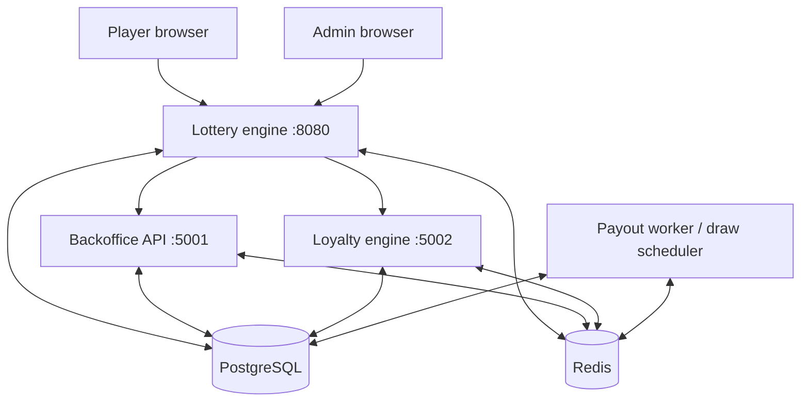

### Lottery-engine components

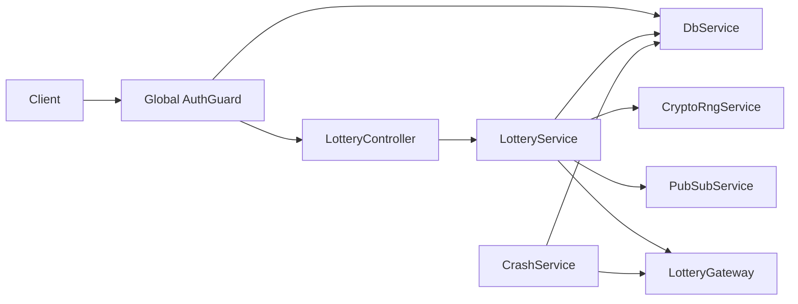

### Deployment topology

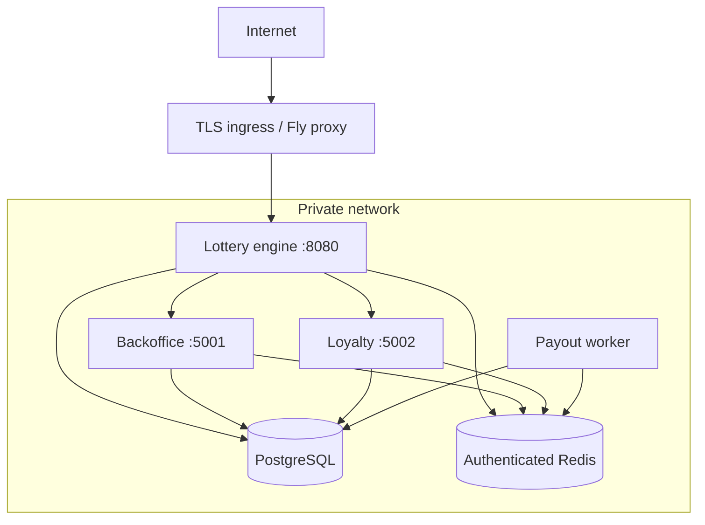

Compose implements the private-network shape. `fly.toml` currently defines only the port-8080 app; the complete multi-process production topology remains to be designed.

### Service communication and data flow

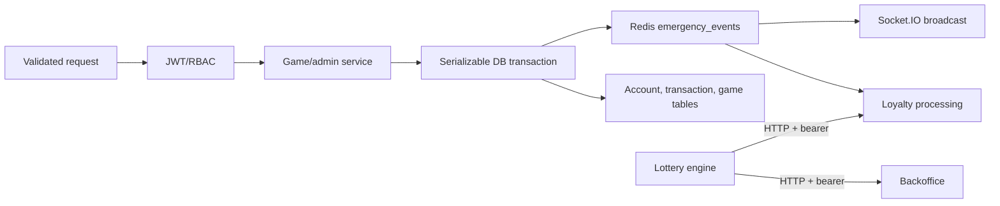

### Request flow

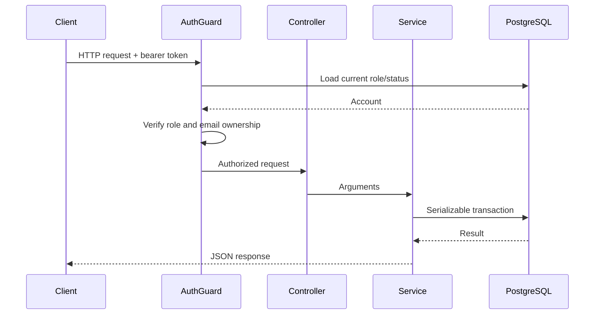

### Authentication flow

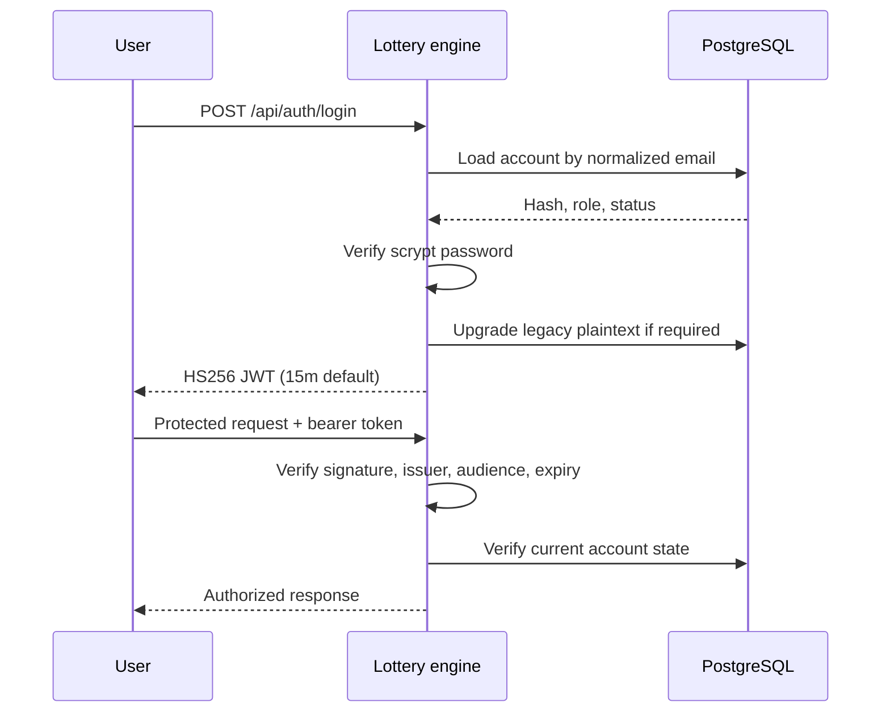

### Bet placement

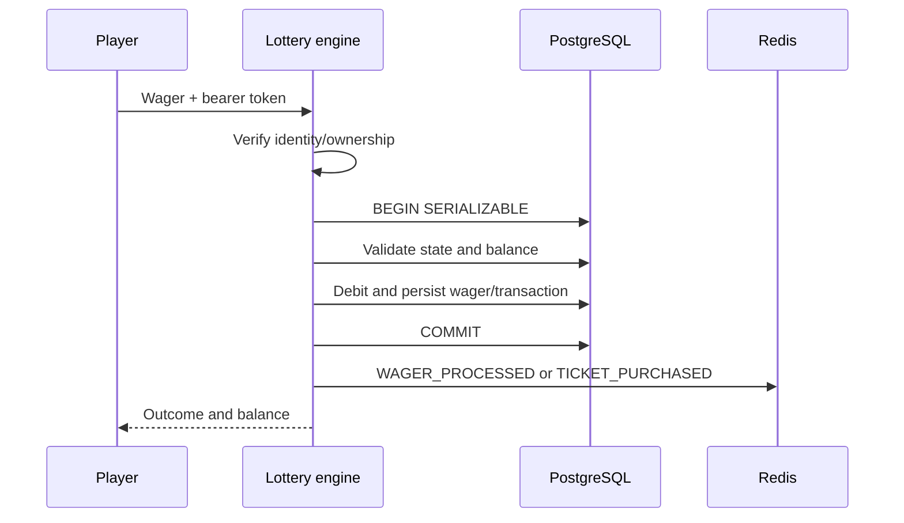

### Withdrawal

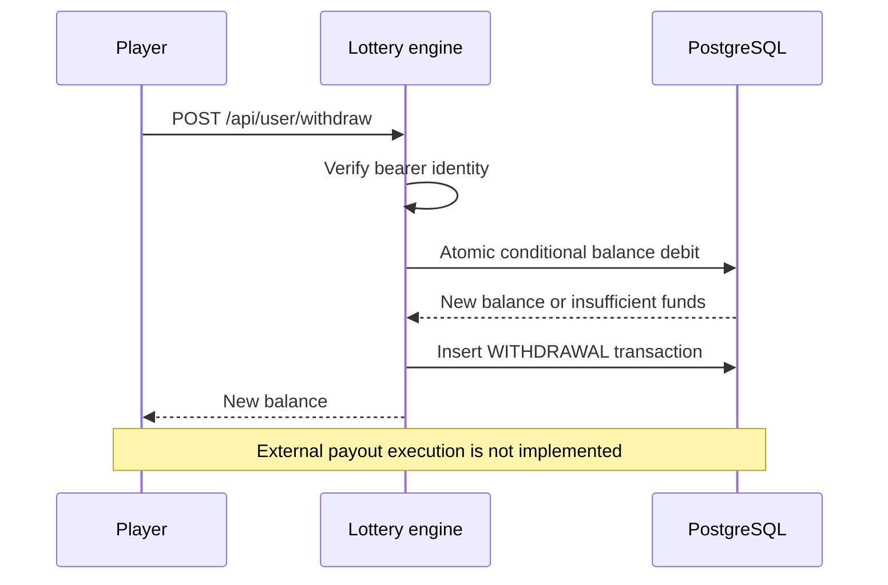

### Loyalty processing

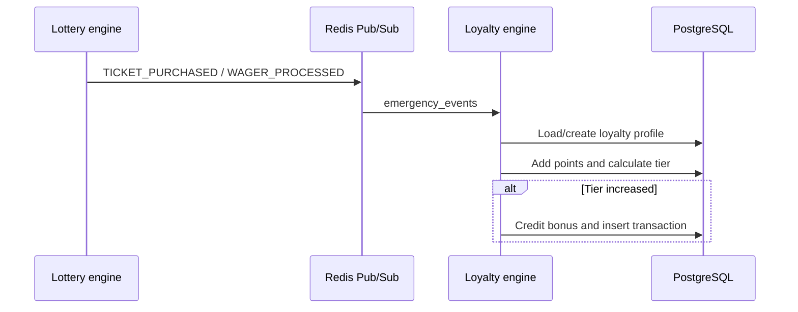

## Repository structure

```text
secure-casino-spinwheel/
|-- apps/
|   |-- lottery-engine/src/
|   |   |-- main.ts                  Bootstrap, CORS, validation, Swagger
|   |   |-- app.module.ts            Module and global guard registration
|   |   |-- lottery.controller.ts    Public/player/admin-proxy HTTP routes
|   |   |-- lottery.service.ts       Auth, wallet, games, affiliates
|   |   |-- lottery.gateway.ts       Player Socket.IO and chat
|   |   |-- crash.service.ts         Crash lifecycle
|   |   |-- auth.guard.ts            JWT, ownership, status, RBAC
|   |   `-- security.decorators.ts   @Public and @Roles metadata
|   |-- backoffice-api/src/
|   |   |-- admin.controller.ts      Privileged endpoints
|   |   |-- admin.service.ts         Configuration/risk/reporting
|   |   |-- admin-auth.guard.ts      ADMIN-only HTTP guard
|   |   |-- events.gateway.ts        ADMIN-only Socket.IO gateway
|   |   |-- app.module.ts
|   |   `-- main.ts
|   |-- loyalty-engine/src/
|   |   |-- loyalty.controller.ts
|   |   |-- loyalty.service.ts
|   |   |-- loyalty-auth.guard.ts
|   |   |-- app.module.ts
|   |   `-- main.ts
|   `-- payout-worker/src/
|       |-- payout.service.ts         Draw timers and settlement
|       |-- app.module.ts
|       `-- main.ts
|-- packages/shared/
|   |-- index.ts                      Exports and legacy singletons
|   `-- src/
|       |-- db.service.ts             Pool, schema, transactions
|       |-- pubsub.service.ts         Redis/IPC/local events
|       |-- crypto-rng.service.ts     Lottery RNG/verification
|       `-- shared.module.ts
|-- frontend/src/                     Player React application
|-- admin-frontend/src/               Backoffice React application
|-- tests/playwright/                 Browser/API tests and helpers
|-- Dockerfile
|-- docker-compose.yml
|-- fly.toml
|-- playwright.config.ts
|-- .env.example
`-- package.json
```

The often-used Nest directories `modules/`, `dto/`, `entities/`, `interceptors/`, and `middleware/` do not exist today. Splitting the large services into those boundaries is a refactoring opportunity, not a documented current state.

## Service catalog

| Service | Purpose and interfaces | Data/events | Failure and scaling notes |
|---|---|---|---|
| Lottery engine | Public `/api` REST and Socket.IO; auth, wallet, all games, internal proxies | Uses most tables; consumes config/draw events; emits wager/ticket/kill-switch and Socket.IO events | PostgreSQL failures fail requests. Horizontal scaling needs a Socket.IO Redis adapter and scheduler separation |
| Backoffice API | ADMIN-only `/api/admin` REST and Socket.IO | Users, config, alerts, tags, bonus rules, audits; emits configuration events | Persistence can succeed before ephemeral event delivery; consumers need reconciliation |
| Loyalty engine | Authenticated `GET /api/loyalty/status` and event consumer | `loyalty_profiles`, `users`, `transactions`; consumes ticket/wager events | Pub/Sub is not replayable. Multiple replicas need durable idempotent consumption |
| Payout worker | No HTTP port; schedules draws and settles lottery tickets | Draws, tickets, RNG audit, users, transactions; emits draw events | Must remain single-active per game until distributed locking/leader election exists |

## API conventions

Development Swagger URLs:

- `http://localhost:8080/api/docs`
- `http://localhost:5001/api/docs`
- `http://localhost:5002/api/docs`

Swagger is disabled in production unless `ENABLE_SWAGGER=true`. Protected requests use:

```http
Authorization: Bearer <access-token>
```

| Concern | Current behavior | Required target |
|---|---|---|
| Versioning | `/api`; no explicit version | Introduce `/api/v1` before external stability |
| Errors | Mostly `{ success: false, error: string }` | Code, message, details, correlation ID |
| Validation | Global pipe; many `any` bodies | DTOs for every contract |
| Rate limiting | Not implemented | Redis-backed account/IP/route limits |
| Pagination | Fixed limits on selected queries | Bounded cursor pagination |
| Filtering/sorting | Endpoint-specific | Allowlisted fields and deterministic order |
| Idempotency | Deterministic lottery payout IDs | Keys for every financial command |

Normalize status codes to `200/201`, `400`, `401`, `403`, `404`, `409`, `422`, `429`, and `500/503`. Some current controllers map domain failures to generic responses.

## Authentication and authorization

1. Registration stores a salted scrypt password and issues an access token.
2. Login verifies scrypt and upgrades a legacy plaintext value after successful authentication.
3. JWTs contain email, username, role, and `jti`.
4. Guards pin HS256, issuer, audience, expiry, database role/status, and supplied-email ownership.
5. Logout/revocation can blacklist `jti` in Redis with a token-aligned TTL.
6. Tokens expire after `JWT_ACCESS_TTL` (`15m` by default).

Refresh-token rotation, reuse detection, HttpOnly cookie sessions, CSRF protection, and MFA are not implemented. The player UI uses browser storage and the admin UI uses session storage; both require a hardened production session design.

## Database architecture

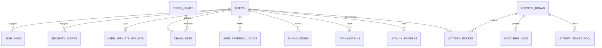

Table groups:

- **Identity/financial:** `users`, `transactions`, `user_session_logs`, `security_alerts`, `user_tags`.
- **Lottery:** `lottery_draws`, `lottery_tickets`, `lottery_ticket_pool`, `audit_rng_logs`, `games_config`.
- **Games:** `spin_wheel_prizes`, slots/dice/crash/Plinko configuration, tournaments, bets, drops.
- **Engagement:** `loyalty_profiles`, referral/affiliate tables, `bonus_rules`.
- **Operations:** `game_settings`, `admin_audit_trail`.

Core primary/foreign keys exist, but index coverage is incomplete. Add query-plan-driven indexes for normalized email, draw name/state, transaction account/time, ticket draw/claimed, and unresolved alerts.

Schema creation currently runs from `DbService` through `CREATE TABLE IF NOT EXISTS` and limited `ALTER TABLE`. Replace it with versioned, forward-only migrations and a dedicated migration role. Development seed accounts are disabled in production. Production backup design must include encrypted snapshots, PITR, off-region copies, retention, and restoration drills. Partitioning should follow measured volume/query requirements.

## Redis and event architecture

Current Redis use:

- Pub/Sub channel `emergency_events`;
- JWT revocation keys `blacklist:<jti>`;
- configuration, draw, wager, ticket, and kill-switch events;
- local EventEmitter/IPC fallback for isolated development.

Redis is not currently a general cache, durable session store, sorted-set leaderboard, presence registry, or BullMQ transport. Pub/Sub provides no replay, acknowledgement, retry, or dead-letter queue.

Current events use upper snake case: `WAGER_PROCESSED`, `TICKET_PURCHASED`, `DRAW_STATE_CHANGED`, `DRAW_COMPLETED`, `KILL_SWITCH`, and configuration update events. New events should carry `eventId`, `eventType`, `eventVersion`, `occurredAt`, `correlationId`, `producer`, and `data`.

Production financial/loyalty work requires a durable stream or queue, idempotent consumers, bounded exponential retry, dead-letter handling, retention, and replay tooling.

## Environment configuration

Copy `.env.example` to `.env`. Real environment files are ignored by Git.

| Variable | Required | Default | Example/security consideration |
|---|---|---|---|
| `NODE_ENV` | Production | Runtime default | `production`; controls seeds, Swagger, mock payments |
| `JWT_SECRET` | Yes | None | 32+ random bytes in secret manager |
| `JWT_ISSUER` | No | `cyber-casino` | Pin identically across services |
| `JWT_AUDIENCE` | No | `cyber-casino-api` | Pin identically across services |
| `JWT_ACCESS_TTL` | No | `15m` | Keep short-lived |
| `POSTGRES_PASSWORD` | Compose | None | Random; `postgres` is rejected in production |
| `REDIS_PASSWORD` | Compose | None | Random; never commit/log |
| `DATABASE_URL` | Alternative | None | Use TLS and secret injection when hosted |
| `PGHOST` | Alternative | `localhost` | Private DNS only |
| `PGUSER` | Alternative | `postgres` | Use least privilege |
| `PGPASSWORD` | Alternative | `postgres` | Never use default in production |
| `PGDATABASE` | No | `cyber_casino` | Separate per environment |
| `PGPORT` | No | `5432` | Never expose publicly |
| `PG_POOL_MAX` | No | `10` | Budget across replicas |
| `REDIS_URL` | Yes | Local fallback | Authenticated/TLS URL in production |
| `CORS_ORIGINS` | Production | Local player origin | Comma-separated exact origins |
| `ADMIN_CORS_ORIGINS` | Production | Local admin origin | Separate admin allowlist |
| `ENABLE_SWAGGER` | No | Off in production | Private ingress only if enabled |
| `ALLOW_MOCK_PAYMENTS` | No | Off in production | Never enable with real funds |
| `RUN_WORKER_CONCURRENTLY` | No | Image-specific | Prevent duplicate schedulers |
| `PORT` | No | Service-specific | Platform-assigned when needed |

Complete `.env.example`:

```dotenv
JWT_SECRET=replace-with-at-least-32-random-bytes
POSTGRES_PASSWORD=replace-with-a-long-random-password
REDIS_PASSWORD=replace-with-a-long-random-password
CORS_ORIGINS=https://casino.example.com
ADMIN_CORS_ORIGINS=https://admin.example.com
```

## Installation and onboarding

Prerequisites: Git 2.40+, Node.js 20, npm, Docker with Compose v2, and 4 GB free memory.

```bash
git clone <repository-url>
cd secure-casino-spinwheel
cp .env.example .env
# Replace every placeholder with a unique secret.
docker compose up --build -d
docker compose ps
docker compose logs -f lottery-engine
curl http://localhost:8080/api/lottery/games
```

PowerShell uses `Copy-Item .env.example .env` instead of `cp`.

PostgreSQL schema initialization currently occurs during service initialization; there is no migration CLI. Production creates no default credentials. Register a player through `/api/auth/register` and provision administrators through a controlled operational migration/identity workflow.

Native development:

```bash
npm ci
npm run start:engine
```

Separate terminals:

```bash
npm run start:frontend
npm run start:admin
```

Configure PostgreSQL, authenticated Redis, `JWT_SECRET`, and CORS variables first.

## Development workflow

- Branch prefixes: `feat/`, `fix/`, `docs/`, `refactor/`, `test/`, `chore/`; Codex-created branches default to `codex/`.
- Use Conventional Commits: `type(scope): imperative summary`.
- Keep pull requests focused and document risk, data changes, deployment, and rollback.
- Require code-owner review; auth, wallet, RNG, payout, schema, and container changes need security/financial-owner review.
- No automated release workflow exists today.

```text
feat(auth): enforce account ownership in game routes
fix(wallet): make withdrawal debit atomic
docs(readme): document production boundaries
```

## Testing strategy

| Layer | Current | Target |
|---|---|---|
| Unit | Not established | Domain/service tests; 80% line/branch target |
| Integration | Not established | PostgreSQL/Redis transactions and events |
| API | Playwright smoke tests | Auth, validation, idempotency, contracts |
| Browser | Playwright | Critical player/admin journeys and cross-browser smoke |
| WebSocket | Indirect/manual | Authentication, reconnect, ordering, expiry |
| Load | Not implemented | k6/Artillery wager/draw/socket scenarios |
| Security | Manual review | SAST, dependencies, containers, secrets, DAST, pen test |

```bash
npm run test:e2e
npm run test:e2e:chromium
npm run test:e2e:smoke
npm run test:e2e:ui
```

## Build and verification

```bash
npm run build --workspace=@cyber-casino/shared
npm run build --workspace=@cyber-casino/lottery-engine
npm run build --workspace=@cyber-casino/backoffice-api
npm run build --workspace=@cyber-casino/loyalty-engine
npm run build --workspace=@cyber-casino/payout-worker
npm run build:frontend
npm run build:admin
docker compose --env-file .env config --quiet
docker build --check .
```

## CI/CD reference pipeline

No workflow is committed. The target pipeline is:

```mermaid
flowchart LR
  PR["Pull request"] --> Install["npm ci"] --> Lint["Lint + typecheck"]
  Lint --> Tests["Unit + integration + E2E"] --> Security["SAST + dependency + secret scans"]
  Security --> Build["Docker build + SBOM"] --> Scan["Image scan + sign"]
  Scan --> Stage["Deploy staging"] --> Smoke["Migrations + smoke"]
  Smoke --> Approval["Production approval"] --> Deploy["Rolling/blue-green"]
  Deploy --> Verify["SLO verification / rollback"]
```

Artifacts should be immutable, digest-pinned, signed, and promoted without rebuilding.

## Security

Implemented:

- private-by-default JWT guards with live role/status and ownership checks;
- ADMIN-only backoffice HTTP and WebSocket access;
- salted scrypt and production seed suppression;
- fail-closed production secrets, explicit CORS, production-disabled Swagger;
- parameterized queries, serializable transactions, atomic deposit/withdrawal;
- authenticated Redis/private Compose network;
- non-root containers, dropped capabilities, `no-new-privileges`.

Required before production:

- Helmet/CSP and standardized headers;
- distributed rate limiting, credential-stuffing defense, bot controls;
- HttpOnly secure sessions, CSRF controls, refresh rotation, MFA;
- DTO validation everywhere and output-encoding/XSS review;
- managed secrets, TLS, rotation, encrypted backups;
- tamper-evident audit logs and correlation IDs;
- signed/replay-protected payments and immutable ledger accounting.

## Observability

Current services use unstructured console logs. Prometheus metrics, OpenTelemetry traces, correlation IDs, centralized dashboards, and dedicated readiness endpoints are not implemented.

The target baseline includes JSON/redacted logs; `/live` and dependency-aware `/ready`; request, pool, conflict, draw, wager, payout, Redis, and WebSocket metrics; OpenTelemetry across HTTP/PostgreSQL/Redis/workers; Grafana dashboards; and SLO-based alerts.

## Performance and scalability

- PostgreSQL pooling defaults to 10 connections per process; budget across replicas.
- Serializable transactions protect correctness but need bounded serialization retries.
- Add indexes from measured query plans.
- Keep one payout scheduler until distributed locking/leader election exists.
- Socket.IO scaling requires a Redis adapter and affinity/state recovery.
- Redis Pub/Sub is ephemeral; use durable transport for critical events.
- Use read replicas only for explicitly stale-safe reporting.
- Every cache needs documented ownership, TTL, invalidation, and consistency.

## Deployment

Docker Compose:

```bash
docker compose up --build -d
docker compose ps
docker compose down
```

`docker compose down --volumes` permanently deletes local PostgreSQL data.

Fly.io: `fly.toml` defines TLS ingress to port 8080 in `iad`. Before deployment, provision managed PostgreSQL/Redis, set secrets, define internal processes, add readiness/capacity, and resolve the conflicting `memory`/`memory_mb` values.

Kubernetes manifests do not exist. Future Kubernetes should use separate Deployments, leader-elected scheduler, Services, NetworkPolicies, PDBs, autoscaling, external secrets, migration Jobs, and observability. Use rolling updates for low-risk stateless changes and blue-green/canary deployment for wallet/game changes. Disaster recovery requires encrypted PITR backups, off-region copies, RTO/RPO, restoration drills, and payout reconciliation.

## Troubleshooting

| Problem | Checks |
|---|---|
| Compose rejects variables | Create `.env` from `.env.example` and replace all placeholders |
| Redis unavailable | `docker compose ps redis`; `docker compose logs redis`; verify password/URL |
| PostgreSQL unavailable | `docker compose ps postgres`; logs; `pg_isready`; verify credentials |
| Schema initialization fails | Find first failed SQL; back up before intervention; avoid ad-hoc production edits |
| JWT 401/403 | Bearer header, shared secret/issuer/audience, expiry, account status/role/email |
| Docker permissions | Ensure daemon access; do not compensate by running app containers as root |
| Playwright browsers missing | Run `npx playwright install` (`--with-deps` in supported Linux CI) |
| Port conflict | Inspect `docker compose ps`; change only host-side development mapping |
| Draws run twice | Ensure only one payout worker/scheduler is active |
| BullMQ jobs absent | Current worker does not consume BullMQ; it uses timers and Pub/Sub |

## FAQ

**Is it production ready?** No. See [Production readiness](#production-readiness).

**Why private by default?** New account or money endpoints cannot accidentally become public; public routes require `@Public()`.

**Why no production default admin?** Committed credentials are unsafe; provision administrators through an audited operational process.

**Why can Redis failure appear to work locally?** The local EventEmitter fallback does not coordinate independent containers.

**Is BullMQ used for payouts?** Not currently. The worker is an interval scheduler.

**Where are migrations?** Schema initialization is currently in `packages/shared/src/db.service.ts`.

**Can payout workers scale horizontally?** Not safely until distributed locking/leader election exists.

## Contributing

1. Reference an issue and acceptance criteria.
2. Create a focused branch.
3. Follow existing TypeScript/React patterns.
4. Add tests and documentation.
5. Run relevant builds/tests, Compose validation, and `git diff --check`.
6. Open a Conventional Commit PR documenting security, data, deployment, and rollback impact.

PR checklist:

- [ ] Scope and behavior are documented.
- [ ] Authentication, authorization, ownership, and validation were reviewed.
- [ ] Financial changes are atomic, idempotent, and concurrency-tested.
- [ ] Schema changes have migration and rollback strategy.
- [ ] Secrets and personal data are neither logged nor committed.
- [ ] Tests cover success and failure paths.
- [ ] Docker/environment documentation is updated.
- [ ] Metrics, alerts, and rollback are considered.

## Roadmap

- Versioned migrations and immutable double-entry ledger.
- Signed payment webhooks, idempotency, payout integration.
- Distributed rate limiting, refresh rotation, MFA, hardened sessions.
- Durable queues/streams, dead-letter handling, replay.
- Service-specific images, Kubernetes/Helm, multi-region operation.
- OpenTelemetry, Prometheus, Grafana, SLOs.
- Event sourcing after ledger stabilization.
- Multi-currency and explicit minor-unit modeling.
- Mobile applications and versioned SDK/API.
- Governed analytics platform.
- Explainable, privacy-aware ML fraud signals with human review.

## Production readiness

Before real funds:

1. Replace floating-point money with integer minor units or constrained `NUMERIC`.
2. Implement immutable double-entry accounting and end-to-end idempotency.
3. Replace mock deposits with signed, replay-protected payment webhooks.
4. Add durable events, distributed rate limits, MFA, session rotation, and admin approval controls.
5. Move schema changes to migrations and enforce least privilege.
6. Add observability, backups, restoration, reconciliation, and disaster-recovery runbooks.
7. Complete concurrency, load, security, RNG, financial, and failure-injection tests.
8. Obtain independent security, ledger, regulatory, privacy, and gambling-compliance reviews.

## License

No license file is included. Until one is added, this repository is **not open source**, and no permission is granted to copy, modify, or redistribute it beyond rights otherwise provided by the owner.
